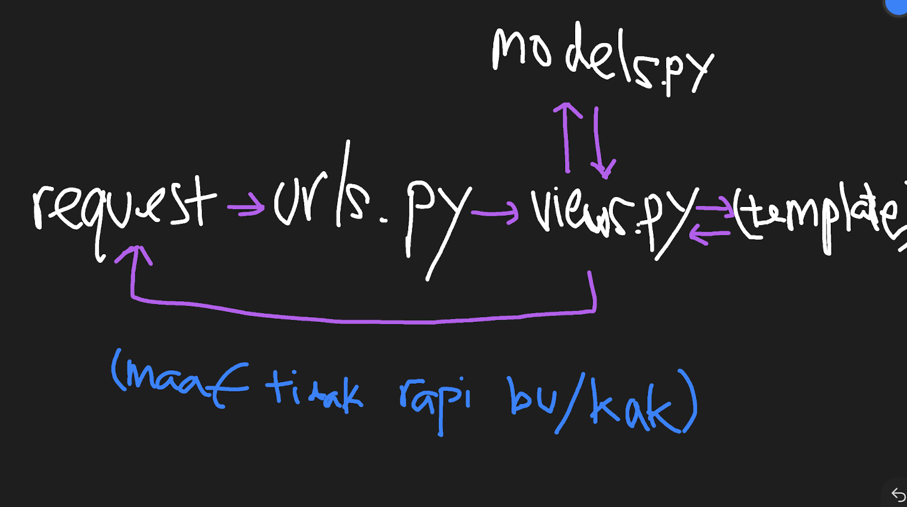

# Tugas 2 PBP
Nama: Givarrel Veivel Pattiwael  
NPM: 2106640341  
Kelas: PBP D  
[apaituplatform.herokuapp.com](http://apaituplatform.herokuapp.com/) -- 
[halaman katalog](http://apaituplatform.herokuapp.com/katalog/)

---

1. **Buatlah bagan yang berisi request client ke web aplikasi berbasis Django beserta responnya dan jelaskan pada bagan tersebut kaitan antara urls.py, views.py, models.py, dan berkas html;**

	

	`views.py` adalah module yang mengendalikan isi konten yang dilihat pengguna website. Ia bertugas mengambil data (model dari `models.py`) dan mengembalikan template (file html) untuk ditampilkan.
	
	Namun, dalam sebuah website umumnya terdapat lebih dari satu halaman (dari sepemahaman saya, ada satu views untuk setiap halaman). Maka pemilihan module `views.py` mana yang akan digunakan bergantung pada `urls.py`. Django akan meng-iterate list urlpatterns dan mencari item pertama yang cocok, kemudian menggunakan `views.py` yang sesuai.

2. **Jelaskan kenapa menggunakan virtual environment? Apakah kita tetap dapat membuat aplikasi web berbasis Django tanpa menggunakan virtual environment?**

	Bisa saja, asal Django dan dependecies terkait sudah terinstall di environment global (utama) Python yang digunakan. Namun kita tetap prefer menggunakan virtual environment agar ada pemisahan antara Python global beserta library-library yang digunakan untuk kepentingan lain, dengan Python virtual env beserta library yang versinya spesifik untuk tugas PBP ini. Jika tidak ada pemisahan tersebut maka sulit untuk mengatasi konflik versi yang bentrok.

3. **Jelaskan bagaimana cara kamu mengimplementasikan poin 1 sampai dengan 4 di atas.**

	Saya pertama meng-clone repository saya dan mulai melihat-lihat objektif Tugas 2 dan file-file yang tersedia. Kemudian saya mulai mencoba-coba mengisi file seperti urls.py dan settings.py di project_django dan membuat virtual environment. Setiap kali ada progress, saya mencoba `python manage.py runserver` untuk melihat apa yang masih kurang. 
	
	Ketika stuck, saya merujuk ke Tutorial Lab 1 untuk mengingat kembali tahapan-tahapan pengerjaan yang saya lakukan. Setelah mengedit *katalog.html, urls.py, views.py* dan *models.py* dalam folder katalog, saya coba melakukan migration. Saya kombinasikan seluruh step 1-4 dengan trial-and-error, sampai berhasil jalan di `localhost:8000`. Setelah itu saya deploy di Heroku dengan cara yang sama dengan Tutorial Lab 0.