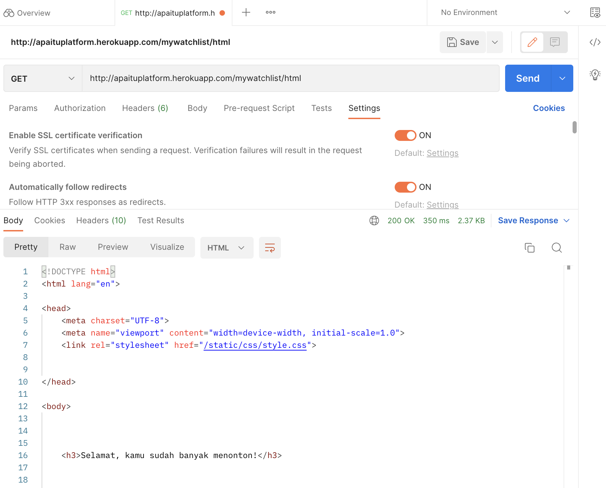
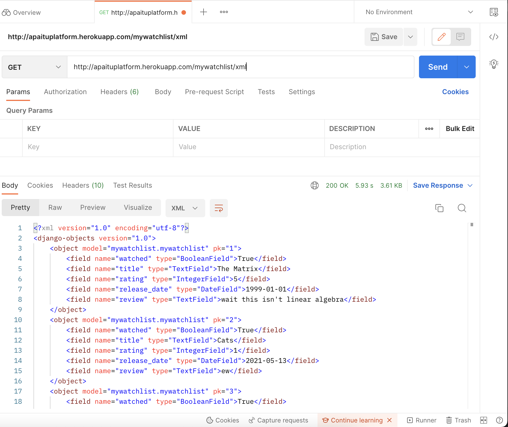
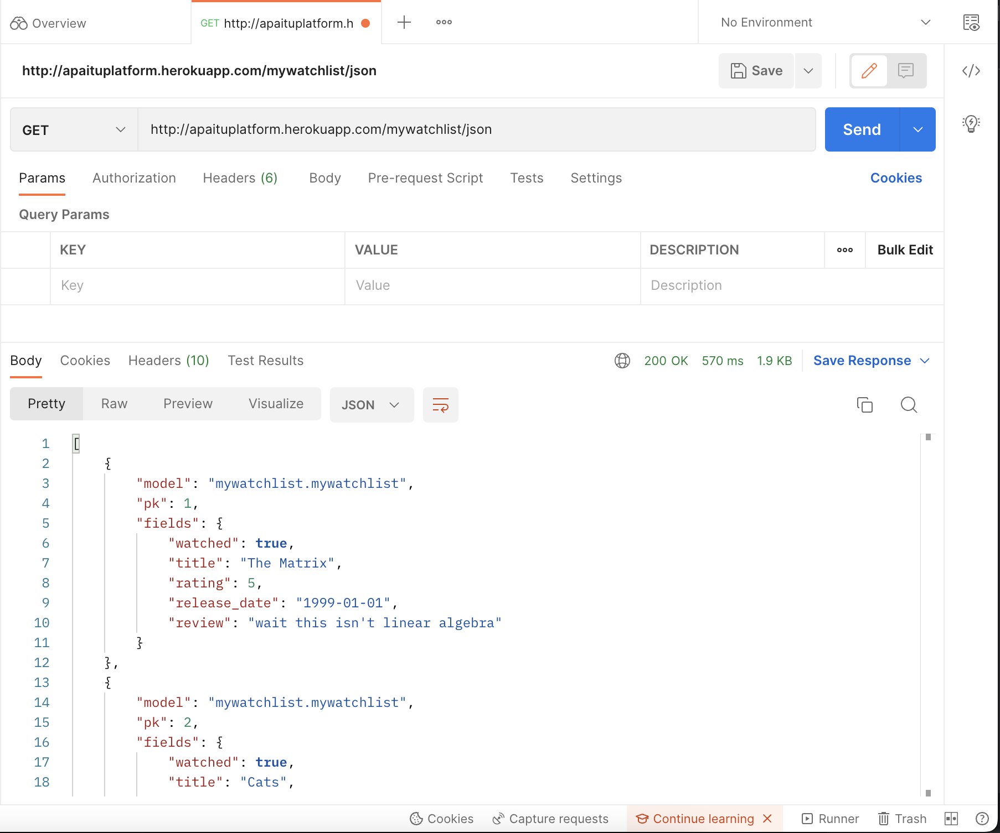

### [Link Heroku Tugas 3](http://apaituplatform.herokuapp.com/mywatchlist/)

Nama	: Givarrel Veivel Pattiwael  
NPM		: 2106640341  
Kelas	: D  

1. **Jelaskan perbedaan antara JSON, XML, dan HTML!**  

	JSON adalah JavaScript Object Notation yang merupakan format data yang dibuat untuk bahasa JavaScript, walaupun bisa dan sering digunakan bahasa lain juga (dengan melakukan parsing). Strukturnya bisa dibandingkan dengan bentuk dictionary dalam Python.
	
	XML adalah eXtensible Markup Language yang merupakan format data yang strukturnya identik dengan pohon. Pada awal / atas setiap dokumen XML terdapat root, kemudian root bercabang menjadi nodes. Nodes tersebut bisa terus bercabang sampai leaf, yaitu node tanpa cabang.
	
	HTML adalah bahasa yang dibuat untuk menampilkan dokumen / hal lain dalam sebuah aplikasi web browser. Sebab itulah kita menggunakan file HTML untuk template dalam tugas ini.

2. **Jelaskan mengapa kita memerlukan data delivery dalam pengimplementasian sebuah platform?**

	Karena tanpa data delivery dari server kepada user, website yang ditampilkan akan static dan tidak menarik. Selain itu, kita perlu pemisahan antara data yang terdapat di server-side, dengan website yang ditampilkan pada client-side browser (Tidak bisa kita simpan semua data kita di template HTML secara langsung).

3. **Jelaskan bagaimana cara kamu mengimplementasikan checklist di atas.**

	Setelah melakukan `python manage.py startapp`, saya membuat model baru dengan data field sesuai kriteria, kemudian membuat `initial_watchlist_data.json`. Saya mengatur `urls `supaya mengarah ke `views.py` yang menampilkan data tadi (yang sudah di-migrate dan di-load) dalam tiga bentuk: html (`show_html`), xml (`show_xml`) dan json (`show_json`).
	
	Setelah banyak trial-and-error di localhost dan berhasil, saya push ke [GH repository](https://github.com/Veivel/tugas-2-pbp) dan deploy ke Heroku. Kemudian, saya mencoba membuat testing untuk setiap bentuk data (HTML, XML, json) dan menjalankannya.
	
	Soal bonus: Pada awalnya saya mengimplementasikan Pandas untuk melakukan parsing pada initial data yang berbentuk json, kemudian memproses data tersebut dalam DataFrame. Namun saya menemukan bahwa QuerySet di Django mendukung filtering, sehingga saya membandingkan jumlah film yang memiliki field `watched = False` dan `watched = True`, kemudian mencetak pesan tergantung yang mana yang lebih baik.
	
**Screenshot mengakses data dengan Postman**

 
 

	
	